# Transit Gateway Multi-VPC Connectivity Configuration

## Overview
This configuration establishes full mesh connectivity between three VPCs (Inspection, Dev, and Prod) using AWS Transit Gateway. All VPCs can communicate with each other through the centralized Transit Gateway hub.

## Architecture Diagram

```mermaid
graph TB
    subgraph Internet
        IGW_INSP[Internet Gateway<br/>Inspection]
        IGW_DEV[Internet Gateway<br/>Dev]
        IGW_PROD[Internet Gateway<br/>Prod]
    end

    subgraph TGW_Layer [Transit Gateway Layer]
        TGW[Transit Gateway<br/>Full Mesh Routing]
    end

    subgraph VPC_Inspection [Inspection VPC - 192.0.0.0/16]
        subgraph Inspection_Public [Public Subnets]
            INSP_PUB_RT[Public Route Table<br/>0.0.0.0/0 → IGW<br/>172.0.0.0/16 → TGW<br/>10.0.0.0/16 → TGW]
            INSP_PUB1[192.0.100.0/24]
            INSP_PUB2[192.0.200.0/24]
        end
        subgraph Inspection_Private [Private Subnets]
            INSP_PRIV_RT[Private Route Table<br/>172.0.0.0/16 → TGW<br/>10.0.0.0/16 → TGW]
            INSP_PRIV1[192.0.1.0/24]
            INSP_PRIV2[192.0.2.0/24]
        end
        TGW_ATTACH_INSP[TGW Attachment]
    end

    subgraph VPC_Dev [Dev VPC - 172.0.0.0/16]
        subgraph Dev_Public [Public Subnets]
            DEV_PUB_RT[Public Route Table<br/>0.0.0.0/0 → IGW<br/>192.0.0.0/16 → TGW<br/>10.0.0.0/16 → TGW]
            DEV_PUB1[172.0.100.0/24]
            DEV_PUB2[172.0.200.0/24]
        end
        subgraph Dev_Private [Private Subnets]
            DEV_PRIV_RT[Private Route Table<br/>192.0.0.0/16 → TGW<br/>10.0.0.0/16 → TGW]
            DEV_PRIV1[172.0.1.0/24]
            DEV_PRIV2[172.0.2.0/24]
        end
        TGW_ATTACH_DEV[TGW Attachment]
    end

    subgraph VPC_Prod [Prod VPC - 10.0.0.0/16]
        subgraph Prod_Public [Public Subnets]
            PROD_PUB_RT[Public Route Table<br/>0.0.0.0/0 → IGW<br/>192.0.0.0/16 → TGW<br/>172.0.0.0/16 → TGW]
            PROD_PUB1[10.0.100.0/24]
            PROD_PUB2[10.0.200.0/24]
        end
        subgraph Prod_Private [Private Subnets]
            PROD_PRIV_RT[Private Route Table<br/>192.0.0.0/16 → TGW<br/>172.0.0.0/16 → TGW]
            PROD_PRIV1[10.0.1.0/24]
            PROD_PRIV2[10.0.2.0/24]
        end
        TGW_ATTACH_PROD[TGW Attachment]
    end

    %% Internet Gateway Connections
    IGW_INSP <--> INSP_PUB_RT
    IGW_DEV <--> DEV_PUB_RT
    IGW_PROD <--> PROD_PUB_RT

    %% Route Table to Subnet Associations
    INSP_PUB_RT --- INSP_PUB1
    INSP_PUB_RT --- INSP_PUB2
    INSP_PRIV_RT --- INSP_PRIV1
    INSP_PRIV_RT --- INSP_PRIV2

    DEV_PUB_RT --- DEV_PUB1
    DEV_PUB_RT --- DEV_PUB2
    DEV_PRIV_RT --- DEV_PRIV1
    DEV_PRIV_RT --- DEV_PRIV2

    PROD_PUB_RT --- PROD_PUB1
    PROD_PUB_RT --- PROD_PUB2
    PROD_PRIV_RT --- PROD_PRIV1
    PROD_PRIV_RT --- PROD_PRIV2

    %% Transit Gateway Connections
    TGW_ATTACH_INSP <--> TGW
    TGW_ATTACH_DEV <--> TGW
    TGW_ATTACH_PROD <--> TGW

    INSP_PRIV1 & INSP_PRIV2 --> TGW_ATTACH_INSP
    DEV_PRIV1 & DEV_PRIV2 --> TGW_ATTACH_DEV
    PROD_PRIV1 & PROD_PRIV2 --> TGW_ATTACH_PROD

    INSP_PUB_RT -.-> TGW
    DEV_PUB_RT -.-> TGW
    PROD_PUB_RT -.-> TGW

    style TGW fill:#ff9900,stroke:#232f3e,stroke-width:3px
    style TGW_ATTACH_INSP fill:#ff9900,stroke:#232f3e
    style TGW_ATTACH_DEV fill:#ff9900,stroke:#232f3e
    style TGW_ATTACH_PROD fill:#ff9900,stroke:#232f3e
```



## Configuration Summary

### VPC CIDR Blocks
- **Inspection VPC**: `192.0.0.0/16`
- **Dev VPC**: `172.0.0.0/16`
- **Prod VPC**: `10.0.0.0/16`

### Transit Gateway Attachments
Each VPC is attached to the Transit Gateway via private subnets:

| VPC | Attachment Subnets |
|-----|-------------------|
| Inspection | 192.0.1.0/24, 192.0.2.0/24 |
| Dev | 172.0.1.0/24, 172.0.2.0/24 |
| Prod | 10.0.1.0/24, 10.0.2.0/24 |

### Route Tables Configuration

#### Private Route Tables
Each private route table routes traffic to the other two VPCs via Transit Gateway:

**Inspection Private RT**:
- `172.0.0.0/16` → Transit Gateway (to Dev VPC)
- `10.0.0.0/16` → Transit Gateway (to Prod VPC)

**Dev Private RT**:
- `192.0.0.0/16` → Transit Gateway (to Inspection VPC)
- `10.0.0.0/16` → Transit Gateway (to Prod VPC)

**Prod Private RT**:
- `192.0.0.0/16` → Transit Gateway (to Inspection VPC)
- `172.0.0.0/16` → Transit Gateway (to Dev VPC)

#### Public Route Tables
Each public route table has:
- Default route `0.0.0.0/0` → Internet Gateway
- Routes to other VPCs → Transit Gateway

**Inspection Public RT**:
- `0.0.0.0/0` → Internet Gateway
- `172.0.0.0/16` → Transit Gateway (to Dev VPC)
- `10.0.0.0/16` → Transit Gateway (to Prod VPC)

**Dev Public RT**:
- `0.0.0.0/0` → Internet Gateway
- `192.0.0.0/16` → Transit Gateway (to Inspection VPC)
- `10.0.0.0/16` → Transit Gateway (to Prod VPC)

**Prod Public RT**:
- `0.0.0.0/0` → Internet Gateway
- `192.0.0.0/16` → Transit Gateway (to Inspection VPC)
- `172.0.0.0/16` → Transit Gateway (to Dev VPC)

## Files Created/Modified

### Modules Created
1. **`terraform/modules/route_table/`** - New module for managing VPC route tables
   - `main.tf` - Route table resources, associations, and routes
   - `variables.tf` - Input variables
   - `outputs.tf` - Output values

### Modules Updated
2. **`terraform/modules/tgw/`** - Updated to support multiple VPC attachments
   - `main.tf` - Now supports `vpc_attachments` map with for_each
   - `variables.tf` - Changed from single VPC to map of VPC attachments
   - `outputs.tf` - Returns map of attachment IDs

### Environment Configuration
3. **`terraform/dev/tgw.tf`** - Updated Transit Gateway configuration
   - Now creates attachments for all three VPCs (Inspection, Dev, Prod)
   - Each attachment uses private subnets from respective VPC

4. **`terraform/dev/route_tables.tf`** - New file for routing configuration
   - Creates Internet Gateways for each VPC
   - Creates private route tables with TGW routes
   - Creates public route tables with IGW and TGW routes

5. **`terraform/dev/outputs.tf`** - Updated with new outputs
   - Transit Gateway ID, ARN, and attachment IDs
   - Route table IDs (public and private)
   - Internet Gateway IDs

## Traffic Flow Examples

### Example 1: Dev to Prod Communication
1. Instance in Dev VPC (172.0.1.10) sends traffic to Prod VPC (10.0.1.20)
2. Dev private route table matches `10.0.0.0/16` → Transit Gateway
3. Transit Gateway routes to Prod VPC attachment
4. Traffic reaches Prod VPC instance

### Example 2: Inspection to Dev Communication
1. Instance in Inspection VPC (192.0.1.10) sends traffic to Dev VPC (172.0.100.50)
2. Inspection private route table matches `172.0.0.0/16` → Transit Gateway
3. Transit Gateway routes to Dev VPC attachment
4. Traffic reaches Dev VPC public subnet instance

### Example 3: Prod Public Subnet Internet Access
1. Instance in Prod public subnet (10.0.100.10) accesses Internet
2. Prod public route table matches `0.0.0.0/0` → Internet Gateway
3. Traffic flows through IGW to Internet
4. Response returns via same path

## Deployment Instructions

1. **Initialize Terraform** (if not already done):
   ```bash
   cd terraform/dev
   terraform init
   ```

2. **Review the plan**:
   ```bash
   terraform plan
   ```

3. **Apply the configuration**:
   ```bash
   terraform apply
   ```

4. **Verify connectivity**:
   - Deploy test instances in each VPC
   - Verify security groups allow ICMP/SSH between VPCs
   - Test ping between instances across VPCs

## Security Considerations

1. **Security Groups**: Ensure security groups allow traffic from other VPC CIDR blocks
2. **Network ACLs**: Configure NACLs to allow inter-VPC traffic if used
3. **Transit Gateway Route Tables**: Currently using default route table with auto-propagation
4. **Logging**: Consider enabling VPC Flow Logs for troubleshooting

## Cost Optimization Notes

- Transit Gateway charges per attachment per hour
- Data transfer charges apply for traffic through TGW
- Consider TGW attachment strategy based on traffic patterns

## Next Steps

1. Update security groups to allow inter-VPC communication
2. Add Network ACL rules if using custom NACLs
3. Configure VPC Flow Logs for monitoring
4. Add CloudWatch metrics for TGW monitoring
5. Consider implementing TGW route table isolation if needed
6. Replicate configuration for production environment
